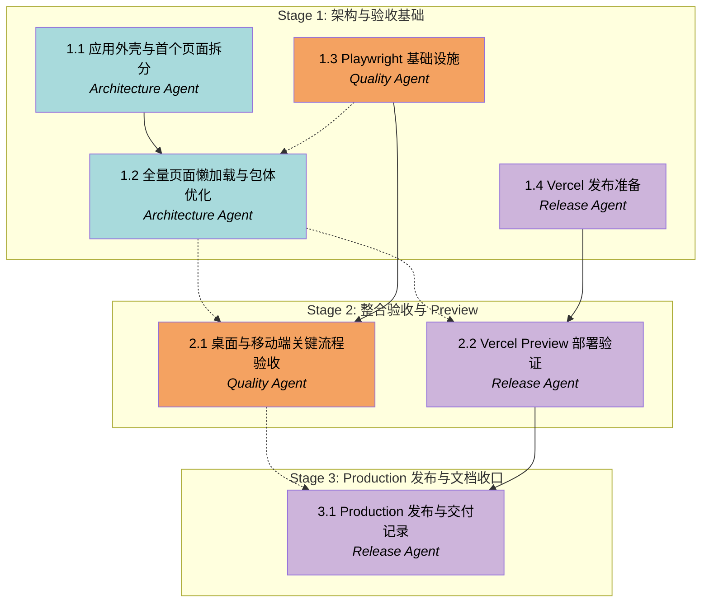

# APM Plan

## Workers

| Worker | Domain | Description |
|---|---|---|
| Architecture Agent | Frontend Architecture | 拆分应用外壳和业务页面，建立路由懒加载边界，按需加载重依赖并优化构建产物。 |
| Quality Agent | Automated QA | 建立 Playwright 基础设施，维护 Vitest 回归，执行桌面与移动端关键业务验收。 |
| Release Agent | Deployment and Release | 管理 Vercel CLI、Preview/Production 发布、线上路由验证和发布文档收口。 |

## Stages

| Stage | Name | Tasks | Agents |
|---|---|---:|---|
| 1 | 架构与验收基础 | 4 | Architecture Agent, Quality Agent, Release Agent |
| 2 | 整合验收与 Preview | 2 | Quality Agent, Release Agent |
| 3 | Production 发布与文档收口 | 1 | Release Agent |

## Dependency Graph

---

> **Notes:** 第一阶段可同时启动 Architecture Task 1.1、Quality Task 1.3 和 Release Task 1.4。Task 1.2 同时依赖应用外壳边界和测试基础设施，避免 `package.json`、路由和测试入口在并行分支中重复修改。第二阶段的浏览器验收与 Preview 部署可以并行，但都必须基于已整合的性能优化结果。第二阶段结束后建议由 Manager 执行一次整体回归和 Preview 汇报；Production 发布是关键审批点，必须得到用户明确确认。

## Stage 1: 架构与验收基础

### Task 1.1: 应用外壳与首个页面拆分 - Architecture Agent

* **Objective:** 从单体 `App.tsx` 中建立稳定的应用外壳和页面组件边界，并以客户项目页面证明拆分方式不改变业务行为。
* **Output:** 应用外壳/布局组件、客户项目页面及其局部表格/表单/详情组件；精简后的 `App.tsx`；必要的页面导出与路由入口文件。
* **Validation:** `pnpm test`、`pnpm build`、`pnpm lint` 和 `git diff --check` 通过；客户项目搜索、新增、编辑、详情和状态流转行为与拆分前一致；其他页面仍可访问；未引入新的构建警告。
* **Guidance:** 遵循 Spec 的 Behavior Preservation 和 Architecture Direction。保留 Zustand store、领域类型和领域规则，不在页面中复制状态机或权限逻辑。优先复用 Ant Design 和现有 CSS class；不要进行视觉重设计。读取 `agent.md`、`docs/sop/README.md` 和客户项目 SOP。当前工作区的未提交业务修复是基线，禁止覆盖。
* **Dependencies:** None

1. 梳理 `App.tsx` 中应用外壳、客户项目页面、共享弹窗与跨页面状态的实际边界。
2. 提取应用外壳组件，保留侧栏、顶部栏、角色选择和内容区域的现有行为。
3. 提取客户项目页面及其表格、搜索、表单和详情交互，使用清晰的 props 或 store selector 连接数据。
4. 保持其余页面临时由现有入口渲染，确保渐进式迁移可运行。
5. 执行自动化检查并人工核对客户项目关键流程；仅在流程或操作说明发生变化时更新 SOP。

### Task 1.2: 全量页面懒加载与包体优化 - Architecture Agent

* **Objective:** 完成其余业务页面组件化和真实路由分包，使入口 JavaScript 达到 Spec 的性能要求。
* **Output:** 业务页面模块、React Router 懒加载配置、统一加载/错误状态、动态 `xlsx` 导出实现、依赖清理和构建体积记录。
* **Validation:** 构建产物包含业务路由 chunk；入口 JavaScript 原始体积低于 500 kB；首屏网络加载不包含 `xlsx` chunk；点击导出后仍生成现有文件名和字段；`pnpm build` 无未解释的超大 chunk 告警；`pnpm test`、`pnpm lint`、`git diff --check` 通过；所有菜单和直接路由可访问。
* **Guidance:** 遵循 Spec 的 Architecture Direction 和 Performance Requirements。页面拆分顺序优先保持业务聚合：工作台/驾驶舱、线索与导入、报价、供应商、成交开拓、批次与对象、SOP 与权限。未知路由应明确处理。只有在源码确认无引用后才能移除 `@ant-design/charts` 或 `@ant-design/pro-components`。避免把所有 Ant Design 代码强制聚合成一个更大的 vendor chunk。
* **Dependencies:** Task 1.1, **Task 1.3 by Quality Agent**

1. 读取 Task 1.1 形成的外壳和页面边界，确认可重复的页面接口模式。
2. 逐个迁移剩余页面、表格、弹窗和抽屉，并在每个迁移点运行相关回归。
3. 将路径映射升级为明确的路由配置，使用动态导入和 Suspense 加载页面。
4. 将 `xlsx` 改为导出动作触发的动态导入，并验证导出结果不变。
5. 检查生产依赖引用并清理确认无用的包。
6. 分析构建产物和网络加载，迭代 chunk 边界直到满足性能验收标准。
7. 执行完整自动化检查，记录最终入口与主要 chunk 体积。

### Task 1.3: Playwright 基础设施 - Quality Agent

* **Objective:** 建立可重复运行的 Playwright 验收基础，并为后续页面拆分提供稳定的路由和页面身份检查。
* **Output:** Playwright 依赖、配置、测试脚本、测试辅助模块、基础桌面/移动端 smoke tests，以及仓库外截图/trace 输出配置。
* **Validation:** 新的 e2e 命令可在本地自动启动 Vite 并运行；Chromium 桌面和移动端用例均能打开首页；测试失败时保留必要诊断但不把截图、trace 或报告写入 Git 跟踪目录；现有 8 条 Vitest 测试继续通过；`pnpm lint` 和 `pnpm build` 通过。
* **Guidance:** 遵循 Spec 的 Quality and Browser Validation。优先使用语义角色、可见文本和稳定业务标识，不以脆弱的 CSS 层级作为主要定位方式。可以补充最少量 `data-testid`，但不得污染用户界面。测试端口应避免与现有开发服务冲突，配置应可在本地和 CI 重复运行。
* **Dependencies:** None

1. 增加 Playwright 测试依赖和统一的 e2e 运行脚本。
2. 配置 Vite webServer、Chromium 桌面项目和移动设备模拟项目。
3. 配置截图、trace 和报告输出到仓库外或被明确忽略的位置。
4. 实现首页与基础路由的页面身份、非空白、无错误覆盖层和控制台健康检查。
5. 运行 Vitest、Playwright、build 和 lint，记录测试环境要求。

### Task 1.4: Vercel 发布准备 - Release Agent

* **Objective:** 确认 Vercel 项目绑定、认证和部署配置可用于后续非全局 CLI 发布，不执行 Production 部署。
* **Output:** 经验证的 `vercel.json`、CLI/认证/项目绑定检查结果、Preview 和 Production 发布命令清单，以及发布前风险记录。
* **Validation:** `pnpm dlx vercel@latest --version`、`whoami` 和项目绑定检查成功；配置确认 Vite 构建、`dist` 输出和 SPA rewrite；`.vercel/`、`.env*` 未进入 Git；本地生产构建通过；未创建 Production deployment。
* **Guidance:** 遵循 Spec 的 Deployment and Release。当前已知账号是 `itangchuan-9342`，项目是 `qixiao-auto-leads-system`。不得输出或提交 token、项目私密配置或环境变量。使用临时 CLI，不新增全局依赖。若项目绑定与当前账号不一致，停止并向用户报告。
* **Dependencies:** None

1. 验证 Vercel CLI 版本、登录身份和 `.vercel/project.json` 绑定关系。
2. 校验 `vercel.json` schema、构建命令、输出目录和 SPA rewrite。
3. 检查忽略规则，确认本地绑定和环境文件不会被提交。
4. 运行本地生产构建，整理 Preview、inspect、logs 和 Production 命令。
5. 记录发布前可能需要用户介入的账户、权限或平台风险。

## Stage 2: 整合验收与 Preview

### Task 2.1: 桌面与移动端关键流程验收 - Quality Agent

* **Objective:** 在整合后的懒加载版本上完成 Spec 要求的浏览器回归，并修复或记录所有可复现缺陷。
* **Output:** 完整 Playwright 用例、桌面/移动端验收结果、仓库外截图证据、控制台检查结果和剩余风险说明。
* **Validation:** `/`、`/leads`、`/customer-projects` 可直接打开和刷新；桌面和移动端无明显重叠、裁切或不可操作控件；管理员、运营、其他角色权限与手机号脱敏正确；有效线索可交付且其他状态不可交付；终态不可非法回退；表单保存和 SmartSelect 可用；应用控制台无相关 error；Vitest、Playwright、build、lint 全部通过。
* **Guidance:** 遵循 Spec 的 Behavior Preservation 和 Quality and Browser Validation。测试必须操作真实 UI 状态，不以直接调用 store 或 helper 代替用户流程。遇到缺陷先建立最小可复现测试，再进行局部修复；修复业务规则时同步对应 SOP。截图只作为对话和验收证据，不提交到仓库。
* **Dependencies:** **Task 1.2 by Architecture Agent**, Task 1.3

1. 更新 smoke tests 以适配最终路由和页面边界。
2. 增加角色切换、手机号脱敏和写入权限用例。
3. 增加线索状态流转、有效线索选择和交付批次用例。
4. 增加表单保存和 SmartSelect 搜索/选择用例。
5. 在桌面与移动端运行完整回归，检查控制台和布局。
6. 对发现的问题创建失败用例、实施最小修复并重新验证。
7. 汇总截图、命令结果和未覆盖风险。

### Task 2.2: Vercel Preview 部署验证 - Release Agent

* **Objective:** 将整合后的构建部署到 Vercel Preview，并验证线上静态资源和 SPA 子路由行为。
* **Output:** Preview deployment URL、部署 inspect 结果、线上路由与资源检查记录、Preview 风险说明。
* **Validation:** Preview 部署成功；`/`、`/leads`、`/customer-projects` 返回应用并可直接刷新；主要 JS/CSS 资源加载成功；无构建错误；Vercel inspect 不显示异常配置；Preview URL 和验证结果被记录。不得发布 Production。
* **Guidance:** 遵循 Spec 的 Deployment and Release。使用 `pnpm dlx vercel@latest` 和现有项目绑定。不得在命令输出、文档或日志中暴露认证信息。若 Preview 部署改变了项目设置或发现线上行为与本地不一致，记录差异并通知 Manager，不自行扩大范围。
* **Dependencies:** **Task 1.2 by Architecture Agent**, Task 1.4

1. 重新运行完整本地构建和配置检查。
2. 创建 Vercel Preview deployment 并保存 URL。
3. 使用 Vercel inspect 和 HTTP 检查确认构建与静态资源状态。
4. 直接访问和刷新三个关键路由，确认 SPA rewrite 生效。
5. 记录 Preview 结果、异常和 Production 前置条件。

## Stage 3: Production 发布与文档收口

### Task 3.1: Production 发布与交付记录 - Release Agent

* **Objective:** 在浏览器验收与 Preview 均通过后，经用户最终确认发布 Production，并完成项目文档收口。
* **Output:** Production deployment、生产 URL、线上验证记录、更新后的发布 SOP、交接报告和最终构建/测试摘要。
* **Validation:** 用户在 Preview 结果汇报后明确批准 Production；Production deployment 成功；`/`、`/leads`、`/customer-projects` 可直接访问和刷新；线上静态资源正常；最终 Vitest、Playwright、build、lint 通过；发布检查和交接报告包含最终 chunk 体积、测试结果、Preview URL、Production URL、已验证路由和剩余风险。
* **Guidance:** 遵循 Spec 的 Deployment and Release 和 Documentation。Production 发布前必须暂停并获得用户确认。只更新与实际结果一致的文档，不保留交接报告中关于 rewrite 缺失、测试未配置或旧未提交文件清单的过期描述。若 Production 验证失败，停止发布收口并保留可回滚信息。
* **Dependencies:** **Task 2.1 by Quality Agent**, Task 2.2

1. 汇总 Task 2.1 和 Task 2.2 的验收结果，向用户展示 Preview 状态和剩余风险。
2. 等待用户明确批准 Production 发布。
3. 执行 Production deployment，并保存生产 URL 与 deployment 信息。
4. 验证生产环境关键路由、静态资源和控制台健康。
5. 更新 `docs/sop/release-checklist.md`、受影响 SOP 和 `docs/project-apm-handoff-report.md`。
6. 运行最终自动化检查，记录构建体积、测试数量、线上地址和剩余风险。
